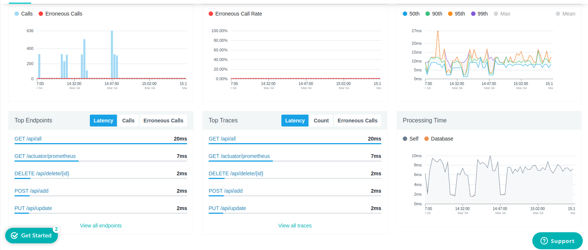

# Metrics

This repository aims at hosting all the materials related to the containers/services/nodes metrics collecting and monitoring.

## Requirements

Historically, we are currently using Nagios and its successor Centreon for monitoring purposes. These solutions worked fine as long as our services and servers were relativelly static. But as soon as we are targeting more and more a micro-services based architecture, these solutions seem to be going to the dogs.

By containerizing it, our architecture went much more complex that it was. The number of replicas is fluctuating. The number of instances we have today might double tomorrow, only to fall to one third the day after. They are distributed across multiple nodes of the cluster, and being moved around. Servers are being created and destroyed. Our cluster and everything inside it is truly dynamic and elastic. The dynamic nature of the system we are building would not fit into Nagios/Centreon, which expects services and servers to be relatively static. It expects us to define things in advance. 

But we do not have the information in advance. Docker Swarm does. Even if we get the information we need, it will change soon. The system we're building is highly dynamic, and the tools we should use to monitor such a system need to be able to cope with this dynamism.

Some of the requirements we'd need from a monitoring system would be as follows:
1. A decentralized way of generating metrics that will be able to cope with the highly dynamic nature of our cluster
2. A multi-dimensional data model that can be queried across as many dimensions as needed
3. An efficient query language that will allow us to exploit our monitoring data model and create effective alerting and visualization
4. Simplicity that will allow (almost) anyone to utilize the system without extensive training

## Technological stack

While Nagios/Centreon does a great job when it comes to system monitoring and alerting, our company is using Instana ALM which provides some more interesting functionalities, like the native integration with container and container orchestration technolgy, as well as the support of more ellaborated metrics and alerts. Instana is one of the strategic investment of our company and, accordingly, we'll be conserving it.

Another big question when it comes to metrics managememnt is what kind of database is the most appropriate to store and handle them ? We are currently using ElasticSearch for centralized logging purposes and we couls extends its usage for the metrics as well. But should we do that or are there any better solutions ?

The biggest problem with Elasticsearch, if used as a database to store system metrics, is that it is not a time series type of database. Logs benefit greatly from Elasticsearch ability to perform free text search and store data in an unstructured way. However, for system metrics, we might take advantage of a different type of data storage. We need a time series database.

One of the most prominent time series databases is Prometheus (`https://prometheus.io/`). Its biggest advantage is that the community plans to expose Docker metrics natively in Prometheus format. At that time, there is no fixed date when that'll happen, but the progress might be followed here: `https://github.com/docker/docker/issues/27307`. Hence, Prometheus may be used in such a way that to switch to Docker native metrics, once they are available.

Prometheus is based on a pull mechanism that scrapes metrics from the configured targets. There are two ways we can generate  Prometheus-friendly data. One is to instrument our own services. Prometheus offers client libraries for Java, Go, Python, Ruby, and others. Instrumenting our services is, in a way, similar to logging.

Even though instrumentation is the preferred way of providing data that will be stored in Prometheus, when our services cannot be instrumented or, even better, when we do not want to instrument them, we can use Prometheus exporters. Their purpose is to collect already
existing metrics and convert them to Prometheus format. And when pulling (scraping) data is not enough, we can change direction and push them. This comes very handy for short-lived jobs which might not be able to pull the data before they are finished and destroyed. In such cases, the short-lived job can push data to the Push Gateway (`https://github.com/prometheus/pushgateway`) from which Prometheus can scrape metrics.

The list of currently supported exporters may be found at the Exporters and Integrations (`https://prometheus.io/docs/instrumenting/exporters/`) section of the Prometheus documentation.

Okay, now that we have an ALM (Instana) and a time-series database (Prometheus) able to collect metrics via its extractors, we need to focus on more container specific metrics. For this purposes we need a *container advisor* and, one of the most common is `cAdvisor` from Google. The `cAdvisor` provides an understanding of the resource usage and performance characteristics of their running containers. It is a running daemon that collects, aggregates, processes, and exports information about running containers. Specifically, for each container it keeps resource isolation parameters, historical resource usage, histograms of complete historical resource usage and network statistics. This data is exported container and machine-wide. It has native support for Docker.

All these metrics collected by Prometheus and cAdvisor need to be now represented in Instana. And since we have Centreon screens showing alarms and alerts, we ideally need to propagate all these metrics to Centreon. Additionally, we might need to centralize everything in a dashboard. Prometheus offers a dashboard builder called PromDash (`https://github.com/prometheus/promdash`). However, it is deprecated for Grafana, so we won't consider it. Instead Grafana (`http://grafana.org/`) is one of the leading tools for querying and visualization
of time series metrics. It features interactive and editable graphs and supports multiple data sources, among others Prometheus of course. Grafana is a truly a rich UI that has established itself as a market leader. And the best of all, it's free.

To resume: our POC consists in the following services:
1. Instana as an ALM
2. Prometheus as the time-series database hosting metrics
3. Prometheus agents to instrumentalize our micro-services such that they generate metrics to be stored in the Prometheus daabse
4. cAdvisor as a container advisor aiming at generating very specialized metrics for containers.
5. Instana sensors for Prometheus and cAdvisor able to propagate metrics to the Instana ALM
6. Graphana as a dashboard (optional) 
7. Centreon (if possible) to represent all the metrics collected by Prometheus and cAdvisor and propagated from Instana.

## A first draft of the POC
Given the complexity of our POC, we decide to take it incrementally. Accordingly, we provide a first draft of it. It consits in a small Java/Spring Boot prototype
having a software architecture based on several Docker interacting containers, as follows:
1. A Docker container running the Press release micro-service. This is a Spring Boot based micro-service provide as an example and, in order to keep closed to our
company's business, it mimics a press release management process. Its architecture is the most common one as it consists in several layers:
    * an REST layer which exposes endpoints for CRUD (Create, Read, Update, Delete) press releases
    * a service layer which implements business logic ontop of the REST layer
    * a persistence layer responsible of persisting the data in a H2 database
    * a model layer defining the business objects handled by the micro-service
    * a data layer defining the entities handled by the micro-service
    * a mapping layer which aims at transforming business objects into entities and the reverse.
This microservice is using Micrometer (`https://micrometer.io/`), an instrumentation library which powers the application metrics delivery from Spring. 
These metrics are collected by the other services, as explained below.
2. A Docker container running a Node Exporter service which aims at exporting all the different metrics related to the Press Release micro-service. Please visit
(`https://github.com/prometheus/nodeexporter`) for more information on Node Exporter.
3. A Docker container running a Google cAdvisor service. The role of this service is, as explained in the introduction part, to bring in the picture
metrics more specific to containers. As a matter of fact, while the Node Exporter handles lots of server centric metrics, it may lack this kind of 
very specific metrics. cAdvisor has also a very nice GUI (Graphical User Interface) which, in general, interests a lot the management. But despite its 
impressive look, this GUI is more or less useless for anything then a single server. That's okay for our first draft POC which runs all the services on a single 
node but, for a more realistic case, especially for a Swarm cluster, it doesn't have much interest.
4. A Docker container running the Prometheus time-series database. This is the database which stores the collected metrics.
5. A Docker container running Grafana. This service will be used in order to design dashboards.

### Modus operandi
Please follow the instructions below in order to build and run the first draft POC:

1. Clone the GIT repository and get the develop branch:

    ```
    nicolas@amx:~$ git clone http://git-infra.rse.argus.int/nicolas.duminil/metrics
    Cloning into 'metrics'...
    remote: Counting objects: 19, done.
    remote: Compressing objects: 100% (19/19), done.
    remote: Total 19 (delta 6), reused 0 (delta 0)
    Unpacking objects: 100% (19/19), done.
    
    nicolas@amx:~$ cd metrics
    nicolas@amx:~/metrics$
    
    nicolas@amx:~$ git checkout develop
    Switched to branch 'develop'
    nicolas@amx:~$ 
    ```
2. Build the project using maven:

    ```
    nicolas@amx:~$ mvn -DskipTests clean install
    [INFO] Scanning for projects...
    [INFO] 
    [INFO] ------------< com.cision.metrics.prometheus:metric-scraper >------------
    [INFO] Building metric-scrapper 1.0-SNAPSHOT
    [INFO] --------------------------------[ jar ]---------------------------------
    [INFO] 
    [INFO] --- maven-clean-plugin:3.1.0:clean (default-clean) @ metric-scraper ---
    [INFO] Deleting /home/nicolas/workspace/scripts/metrics/target
    [INFO] Deleting /home/nicolas/workspace/scripts/metrics/src/main/docker (includes = [**/metric-scraper.jar], excludes = [])
    [INFO] 
    [INFO] --- docker-compose-maven-plugin:2.5.1:down (down) @ metric-scraper ---
    [INFO] Removing volumes
    [INFO] Docker Compose Files: /home/nicolas/workspace/scripts/metrics/src/main/resources/docker-compose.yml
    [INFO] Running: docker-compose -f /home/nicolas/workspace/scripts/metrics/src/main/resources/docker-compose.yml down -v
    Stopping instana       ... done
    Stopping grafana       ... done
    Stopping advisor       ... done
    Stopping node_exporter ... done
    Removing cision_press_release ... done
    Removing instana              ... done
    Removing grafana              ... done
    Removing prometheus           ... done
    Removing advisor              ... done
    Removing node_exporter        ... done
    Removing network resources_default
    [INFO] 
    [INFO] --- maven-resources-plugin:3.1.0:resources (default-resources) @ metric-scraper ---
    [INFO] Using 'UTF-8' encoding to copy filtered resources.
    [INFO] Copying 1 resource
    [INFO] Copying 2 resources
    [INFO] 
    [INFO] --- maven-compiler-plugin:3.7.0:compile (default-compile) @ metric-scraper ---
    [INFO] Changes detected - recompiling the module!
    [INFO] Compiling 10 source files to /home/nicolas/workspace/scripts/metrics/target/classes
    [INFO] 
    [INFO] --- maven-resources-plugin:3.1.0:testResources (default-testResources) @ metric-scraper ---
    [INFO] Using 'UTF-8' encoding to copy filtered resources.
    [INFO] Copying 1 resource
    [INFO] 
    [INFO] --- maven-compiler-plugin:3.7.0:testCompile (default-testCompile) @ metric-scraper ---
    [INFO] Changes detected - recompiling the module!
    [INFO] Compiling 1 source file to /home/nicolas/workspace/scripts/metrics/target/test-classes
    [INFO] /home/nicolas/workspace/scripts/metrics/src/test/java/com/cision/metrics/prometheus/scraper/TestPressReleaseIT.java: /home/nicolas/workspace/scripts/metrics/src/test/java/com/cision/metrics/prometheus/scraper/TestPressReleaseIT.java uses unchecked or unsafe operations.
    [INFO] /home/nicolas/workspace/scripts/metrics/src/test/java/com/cision/metrics/prometheus/scraper/TestPressReleaseIT.java: Recompile with -Xlint:unchecked for details.
    [INFO] 
    [INFO] --- maven-surefire-plugin:2.22.2:test (default-test) @ metric-scraper ---
    [INFO] Tests are skipped.
    [INFO] 
    [INFO] --- maven-jar-plugin:3.1.2:jar (default-jar) @ metric-scraper ---
    [INFO] Building jar: /home/nicolas/workspace/scripts/metrics/target/metric-scraper.jar
    [INFO] 
    [INFO] --- spring-boot-maven-plugin:2.2.5.RELEASE:repackage (repackage) @ metric-scraper ---
    [INFO] Replacing main artifact with repackaged archive
    [INFO] 
    [INFO] --- maven-resources-plugin:3.1.0:copy-resources (copy-resources) @ metric-scraper ---
    [INFO] Using 'UTF-8' encoding to copy filtered resources.
    [INFO] Copying 1 resource
    [INFO] 
    [INFO] --- maven-install-plugin:2.5.2:install (default-install) @ metric-scraper ---
    [INFO] Installing /home/nicolas/workspace/scripts/metrics/target/metric-scraper.jar to /home/nicolas/.m2/repository/com/cision/metrics/prometheus/metric-scraper/1.0-SNAPSHOT/metric-scraper-1.0-SNAPSHOT.jar
    [INFO] Installing /home/nicolas/workspace/scripts/metrics/pom.xml to /home/nicolas/.m2/repository/com/cision/metrics/prometheus/metric-scraper/1.0-SNAPSHOT/metric-scraper-1.0-SNAPSHOT.pom
    [INFO] 
    [INFO] --- docker-compose-maven-plugin:2.5.1:up (up) @ metric-scraper ---
    [INFO] Running in detached mode
    [INFO] Docker Compose Files: /home/nicolas/workspace/scripts/metrics/src/main/resources/docker-compose.yml
    [INFO] Running: docker-compose -f /home/nicolas/workspace/scripts/metrics/src/main/resources/docker-compose.yml up -d --no-color
    Creating network "resources_default" with the default driver
    Creating node_exporter ... done
    Creating advisor       ... done
    Creating prometheus    ... done
    Creating grafana       ... done
    Creating instana       ... done
    Creating cision_press_release ... done
    [INFO] ------------------------------------------------------------------------
    [INFO] BUILD SUCCESS
    [INFO] ------------------------------------------------------------------------
    [INFO] Total time:  10.585 s
    [INFO] Finished at: 2020-03-03T13:33:28+01:00
    [INFO] ------------------------------------------------------------------------
    ```
3. Check that all the required Docker containers are up and running:

    ```
    nicolas@amx:~$ docker ps
    CONTAINER ID        IMAGE                       COMMAND                  CREATED             STATUS              PORTS                    NAMES
    ff889b499ad0        openjdk:8-jdk-alpine        "/usr/local/share/hm…"   5 seconds ago       Up 4 seconds        0.0.0.0:8081->8081/tcp   cision_press_release
    fb885334f561        instana/agent               "./bin/run.sh"           5 seconds ago       Up 4 seconds                                 instana
    b58aff5bf43a        grafana/grafana:4.5.2       "/run.sh"                6 seconds ago       Up 5 seconds        0.0.0.0:3000->3000/tcp   grafana
    6189d4a5580e        google/cadvisor:v0.24.1     "/usr/bin/cadvisor -…"   7 seconds ago       Up 6 seconds        0.0.0.0:8080->8080/tcp   advisor
    8dd855cc1a1c        basi/node-exporter:v0.1.1   "/docker-entrypoint.…"   7 seconds ago       Up 6 seconds        0.0.0.0:9100->9100/tcp   node_exporter
    nicolas@amx:~$ 
    ```
4. Check that all the services are started and that there are no exceptions raised. You should see a listing similar to the below one. Here, the services
   Node Exporter, cAdvisor, Grafana, etc. are started one after one and our Cision Press Release service waits for all of them to have started before it starts itself.

    ```
    nicolas@amx:~$ docker logs cision_press_release --details
    ********************************************************
    Waiting for the Node Exporter service to start 9100
    ********************************************************
    >>>>>>>>>>>> The Node Exporter service has started
    ********************************************************
    Waiting for the cAdvisor service to start on port 8080
    ********************************************************
    ******* The cAdvisor service has started
    ********************************************************
    Waiting for the Prometheus service to start on port 9090
    ********************************************************
    ******* The Prometheus service has started
    ********************************************************
    Waiting for the Grafana service to start on port 3000
    ********************************************************
    ******* The Grafana service has started
    ********************************************************
    Starting the Cision Press Release service on 
    ********************************************************
    LOGBACK: No context given for c.q.l.core.rolling.SizeAndTimeBasedRollingPolicy@1022308509
    
      .   ____          _            __ _ _
     /\\ / ___'_ __ _ _(_)_ __  __ _ \ \ \ \
    ( ( )\___ | '_ | '_| | '_ \/ _` | \ \ \ \
     \\/  ___)| |_)| | | | | || (_| |  ) ) ) )
      '  |____| .__|_| |_|_| |_\__, | / / / /
     =========|_|==============|___/=/_/_/_/
     :: Spring Boot ::        (v2.2.5.RELEASE)
    
    2020-03-03 13:33:38.867  INFO 10 --- [           main] c.c.m.prometheus.scraper.ScraperApp      : Starting ScraperApp v1.0-SNAPSHOT on cision_press_release with PID 10 (/usr/local/share/hml/metric-scraper.jar started by root in /)
    2020-03-03 13:33:38.870  INFO 10 --- [           main] c.c.m.prometheus.scraper.ScraperApp      : No active profile set, falling back to default profiles: default
    2020-03-03 13:33:40.155  INFO 10 --- [           main] .s.d.r.c.RepositoryConfigurationDelegate : Bootstrapping Spring Data JPA repositories in DEFAULT mode.
    ....
    nicolas@amx:~/workspace/scripts/metrics$ 
    ```
5. Use the Swagger interface to exercise the REST API. The Cision Press Release REST layer exposes a Swagger interface on the behalf of which you can exercice and
test the API. Use your preferred browser to navigate at `http://<ip-address>:8081/swagger-ui.html#/`, where *<ip-address>* is the IP address of the container running 
the Cision Press release service. It may be obtain using the following command:

    ```
    nicolas@amx:~$ docker exec -it cision_press_release ip addr
        1: lo: <LOOPBACK,UP,LOWER_UP> mtu 65536 qdisc noqueue state UNKNOWN qlen 1000
           link/loopback 00:00:00:00:00:00 brd 00:00:00:00:00:00
           inet 127.0.0.1/8 scope host lo
           valid_lft forever preferred_lft forever
        310: eth0@if311: <BROADCAST,MULTICAST,UP,LOWER_UP,M-DOWN> mtu 1500 qdisc noqueue state UP 
             link/ether 02:42:c0:a8:e0:07 brd ff:ff:ff:ff:ff:ff
             inet 192.168.224.7/20 brd 192.168.239.255 scope global eth0
             valid_lft forever preferred_lft forever
    nicolas@amx:~$
    ```
6. In order to exercise the API interface, you need to unwind the dro-down labeled `press-release-controller`. The following screen will be presented to you:

    
    Here you can use the buttons POST, GET, PUT and DELETE in order to create, read, update and delete press releases.
   
7. Once you have exercised for a while the API via the Swagger interface, you probably get tired after a few minutes. In order to perform some bulk operations,
you mayrun the following command which will create 100 press releases, before updating and deleting them. All this will create activity on the REST API allowing 
its instrumentation layer to generate metrics.   

    ```
    nicolas@amx:~$ mvn test
    [INFO] Scanning for projects...
    [INFO] 
    [INFO] ------------< com.cision.metrics.prometheus:metric-scraper >------------
    [INFO] Building metric-scrapper 1.0-SNAPSHOT
    [INFO] --------------------------------[ jar ]---------------------------------
    [INFO] 
    [INFO] --- maven-resources-plugin:3.1.0:resources (default-resources) @ metric-scraper ---
    [INFO] Using 'UTF-8' encoding to copy filtered resources.
    [INFO] Copying 1 resource
    [INFO] Copying 2 resources
    [INFO] 
    [INFO] --- maven-compiler-plugin:3.7.0:compile (default-compile) @ metric-scraper ---
    [INFO] Nothing to compile - all classes are up to date
    [INFO] 
    [INFO] --- maven-resources-plugin:3.1.0:testResources (default-testResources) @ metric-scraper ---
    [INFO] Using 'UTF-8' encoding to copy filtered resources.
    [INFO] Copying 1 resource
    [INFO] 
    [INFO] --- maven-compiler-plugin:3.7.0:testCompile (default-testCompile) @ metric-scraper ---
    [INFO] Nothing to compile - all classes are up to date
    [INFO] 
    [INFO] --- maven-surefire-plugin:2.22.2:test (default-test) @ metric-scraper ---
    [INFO] 
    [INFO] -------------------------------------------------------
    [INFO]  T E S T S
    [INFO] -------------------------------------------------------
    15:27:30.943 [main] DEBUG org.springframework.test.context.junit4.SpringJUnit4ClassRunner - SpringJUnit4ClassRunner constructor called with [class com.cision.metrics.prometheus.scraper.TestPressReleaseIT]
    15:27:30.946 [main] DEBUG org.springframework.test.context.BootstrapUtils - Instantiating CacheAwareContextLoaderDelegate from class [org.springframework.test.context.cache.DefaultCacheAwareContextLoaderDelegate]
    ....    
      .   ____          _            __ _ _
     /\\ / ___'_ __ _ _(_)_ __  __ _ \ \ \ \
    ( ( )\___ | '_ | '_| | '_ \/ _` | \ \ \ \
     \\/  ___)| |_)| | | | | || (_| |  ) ) ) )
      '  |____| .__|_| |_|_| |_\__, | / / / /
     =========|_|==============|___/=/_/_/_/
     :: Spring Boot ::        (v2.2.5.RELEASE)
    
    2020-03-03 15:27:31.459  INFO 22391 --- [           main] c.c.m.p.scraper.TestPressReleaseIT       : Starting TestPressReleaseIT on amx with PID 22391 (started by nicolas in /home/nicolas/workspace/scripts/metrics)
    2020-03-03 15:27:31.468  INFO 22391 --- [           main] c.c.m.p.scraper.TestPressReleaseIT       : No active profile set, falling back to default profiles: default
    2020-03-03 15:27:32.350  INFO 22391 --- [           main] .s.d.r.c.RepositoryConfigurationDelegate : Bootstrapping Spring Data JPA repositories in DEFAULT mode.
    ...
    2020-03-03 15:27:35.493  INFO 22391 --- [           main] c.c.m.p.scraper.TestPressReleaseIT       : Started TestPressReleaseIT in 4.254 seconds (JVM running for 5.026)
    [INFO] Tests run: 5, Failures: 0, Errors: 0, Skipped: 0, Time elapsed: 6.371 s - in com.cision.metrics.prometheus.scraper.TestPressReleaseIT
    2020-03-03 15:27:37.629  INFO 22391 --- [extShutdownHook] o.s.s.concurrent.ThreadPoolTaskExecutor  : Shutting down ExecutorService 'applicationTaskExecutor'
    2020-03-03 15:27:37.633  INFO 22391 --- [extShutdownHook] j.LocalContainerEntityManagerFactoryBean : Closing JPA EntityManagerFactory for persistence unit 'default'
    2020-03-03 15:27:37.634  INFO 22391 --- [extShutdownHook] .SchemaDropperImpl$DelayedDropActionImpl : HHH000477: Starting delayed evictData of schema as part of SessionFactory shut-down'
    2020-03-03 15:27:37.643  INFO 22391 --- [extShutdownHook] com.zaxxer.hikari.HikariDataSource       : HikariPool-1 - Shutdown initiated...
    2020-03-03 15:27:37.657  INFO 22391 --- [extShutdownHook] com.zaxxer.hikari.HikariDataSource       : HikariPool-1 - Shutdown completed.
    [INFO] 
    [INFO] Results:
    [INFO] 
    [INFO] Tests run: 5, Failures: 0, Errors: 0, Skipped: 0
    [INFO] 
    [INFO] ------------------------------------------------------------------------
    [INFO] BUILD SUCCESS
    [INFO] ------------------------------------------------------------------------
    [INFO] Total time:  8.741 s
    [INFO] Finished at: 2020-03-03T15:27:38+01:00
    [INFO] ------------------------------------------------------------------------
    nicolas@amx:~/workspace/scripts/metrics$ 
    ```
8. Now everything is in place to start your monitoring session. First you migh want to exercise cAdvisor. Go to `http://<ip-address>:8080` and you'll see something like th efollowing:

    Spend some time navigating among all the proposed options.
    
9. In order to see the collected metrics, you may go to the Prometheus console at `http://<ip-address>:9090/targets` and the following screen will be presented to you:
  
    Here, clicking on the displayed links, you'll see the list of all the metrics proposed and available to us. Click on the `Graph` option in the menu bar and a new 
    screen having a search area will be displayed. type `metrics` in this search bar and the full list of the metrics having a name starting with this word will be proposed.
    Select one of them, for example `metrics_pressRelease_add_seconds_bucket` and type return. A long list ov values will be displayed in the Prometheus console and, if you click on the 
    `Graph` tab you'll se the graphic representation of the time-series values of the selected metric.  
    
10. Now, having all these hundreds of metrics, the million dollars question is: "What do I do with them all ?". Well, here comes the fun part. Using Grafana 
you may build your own dashboards such that to highlight the metrics you're most interested in. Go to `http://<ip-address>:3000` and you'll land on the Grafana home page.  
Here you need to login as `admin/admin`. 
Now, the first thing to do is to add Prometheus as data source. Please click the Grafana logo located in the top-left part of the screen, 
select Data Sources, and click the + Add data source button. We'll name it Prometheus and choose the same for the Type. Enter http://prometheus:9090 as the Url 
and click the Add button. That's it. From now on, we can visualize and query any metric stored in Prometheus. 
Let's create the first dashboard. Please click on the `+` sign in the leftmost pane and, in the unwinded drop-down select `dashboard`. 
The `New Panel` screen will be displayed. Here click on the button `Add query` and, in the `New dashboard` screen which is displayed, in the text field
labeled `metrics`, type the following `rate(metrics_pressRelease_add_seconds_bucket{job="cision_press_release"}[5m])`. After a few seconds, if you click on the 
`Visualization` button in the left-most pane, you'll see something like this:


11. Now it's time to go to Instana. For the purposes of this POC I've used their free trial at `http://instana.com`. You need to create an account and,
once logged-in, you should be able to see our services running. Selecting the cision_press_release service and clicking on the `Dashboard` button, you should
be presented with a screen like this:


## Conclusions further to the first draft POC
We managed to prove during this first draft POC that we are able to:
1. instrumentalize Spring Boot services on the behalf of the Micrometer library such that to generate customized metrics
2. collect these customized metrics, together with standard Prometheus and cAdvisor metrics in a time-series database
3. to represent all these metrics in different ways, using Prometheus graphs, cAdvisor GUI or Grafana dashboards
4. to track and monitor our Spring Boot microservices with Instana

However, we didn't yet manage to prove that our customized metrics are available in Instana.

## Goals for future developments of the POC
We need to find a way to propagate our customized metrics to Centreon such that to take advantage of our current monitoring system.

   